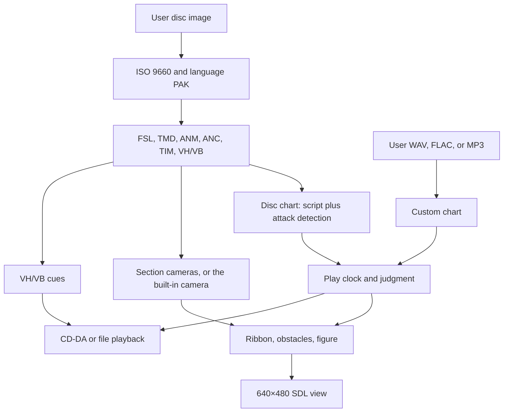

# Architecture

Oscilline is a C++20 library and a few programs. It reads a disc image the user owns and plays courses from that disc, or charts a music file with no disc. PAL `SCES-02873` is the primary disc. Japanese `SCPS-45469` is also accepted (Experimental). Anything drawn when no disc model resolves is original placeholder art. The window is titled Oscilline and shows no disc logo; with no resolved font the wordmark is SDL debug text.

`oscilline_core` is the static library: disc reading, parsers, the course timeline, and line expansion. SDL3 is linked only into `oscilline_present`, which `oscilline` and `oscilline-viewer` use for the window and for playback. There is no `tools/` directory. The extra programs are separate executables.

## Programs

| Binary | Role |
| --- | --- |
| `oscilline` | SDL3 window. Options edits the saved settings, controls, and HUD choices. A difficulty loads both courses from `SCRIPT/SYSTEM3.FSL` and that disc's CD-DA behind one loading screen, then plays them back to back. `--course N` with `--play` loads one course. `--music` charts a WAV, FLAC, or MP3. `--play` skips the title and exits 1 when neither a disc nor music was given. With no disc the title shows "NO DISC", hides Play Original, prints how to load one, and exits 0 when closed. `--frames N` exits after N presented frames, including loading frames, so CI can run it headless. |
| `oscilline-viewer` | `--disc <cue>` draws TMD wireframes with ANM playback. Default view is the side profile (`--view side\|front`). Drag orbits the framed model, the wheel zooms. `--anc <name>` draws a camera path. Eye-to-target lines are strided to about 50 (`--anc-step N`). Tab opens the SFX browser from the model view or the camera view, and Tab returns. `--sfx` starts in that browser. The list is every `SfxId`, then unidentified bank samples that `kSfxMap` does not play. |
| `oscilline-extract` | Lists or copies files out of a disc image. |
| `oscilline-inspect` | JSON for one file: PAK, TIM, TMD, ANM, ANC, VH/VB, or FSL. A `.vb` needs `--vh`. `--full-pcm` includes decoded samples. |
| `oscilline-chart` | One `hit_ms obstacle` line per obstacle for a disc course. `--attacks` prints the picked attack times. |

## Modules

| Area | Responsibility |
| --- | --- |
| `disc/` | BIN/CUE or ISO, ISO 9660, boot-file check, language PAK (`GAME/02_FILES.PAK`, then `01`, then `FILES.PAK`). |
| Parsers | `pak`, `tim`, `tmd`, `anm`, `anc`, `vab` / `adpcm`, `fsl`. `Result<T>` is a value or an error string. Parsers do not throw. `ByteReader` is little-endian and latches the first overrun. |
| `asset/` | Asset map and confidence gate, registry, character clips, menu models, meters, silent stand-ins. |
| `course/` | FSL load, hit times, live attack detection, custom-music charts, judgment, cameras, ribbon jitter, obstacle outlines, the placeholder figure. |
| `render/` | 640×480 logical view, CPU strokes, TMD posing and projection, the 60 Hz step clock. |
| `audio/` | CD-DA sector decode, VH/VB event cues, WAV/FLAC/MP3 decode. |
| `present/` | SDL window and input (including the rebindable gameplay keys and buttons), the playback clock, the cue mixer. |
| `app/` | Title, session, course drawing and HUD, the score-coupon carousel, font output, the cue stage. Runs take one `PlayOptions` (built by `play_options` from the effective settings and `RunFlags`), and `draw_course` takes one `CourseView`. The title is a `TitleScreen` with one method per update mode and one draw method per menu page. |
| `controls`, `settings` | Gameplay bindings and the saved options file. No SDL dependency. |

Counts that would allocate without bound (archive entries, model elements, course tables, ADPCM body size) are rejected.

## Data flow

A disc course reads `SCRIPT/SYSTEM3.FSL` from the language archive. Course index `i` plays CD track `i + 2`. Obstacle times follow samples the audio device has consumed. Custom music charts a file on its own. With a disc path and disc assets allowed, it loads the same character, sound, and menu-art map as a built-in course, and it can use that disc's camera. Without a disc, those slots stay placeholders and the camera stays the built-in path. With a disc and the disc camera, custom music uses equal section slices on the tier's course row. The looping pan plays at stage start and fills quiet gaps of at least 4 s.

## Disc assets

Loaded at runtime from the user's own image. Nothing extracted is stored in this tree.

- **PAK** holds the language archives. Offsets are file-absolute.
- **TIM** is parsed. Boot-logo images are not shown.
- **TMD** and **ANM** are the models and clips. The course figure fills polygons. The viewer still draws polygon edges. Each eye is its own object, the only one with a pure black (`0x000000`) fill. Facing the camera both eyes show; turned more than 45° away the eye farther from the camera hides, until the turn is back inside 40°; facing away, past 150°, both hide until the turn is back inside 146°. The head outlines' `0x010000` fill triangles are not drawn, since they do not cover the outline. Character clips (singles, pairs, whiffs, and misses) and menu-model clips are high confidence and play at the default floor. The TITLE/VIBRI menu model stays high, but menus do not draw it while `kShowMenuCharacter` is false. Set that constant to true to show her again. `--asset-confidence` still holds meters, rank marks, results digits, the menu wheel and labels, and the menu camera.
- **Action clips.** A clear plays the plain clip (J, L, W, H, or a pair: JH, JL, JW, HL, HW, LW). A whiff plays the `_F` stem when the form has one, otherwise the plain clip; the rabbit has no W_F or H_F. A wrong button plays no action clip, and a miss plays the MISS stem. `--clips-test` lists every clip slot with its confidence; with `--disc` it also lists the clip each form plays.
- **ANC** is a camera path: 6-byte header, then 16-byte records.
- **VH/VB** is the SPU-ADPCM bank. Game, title, and tutorial banks load beside the music.
- **FSL** is the course script. The parser only reads the file. Hit times live in the course module.

Paths, confidence, and which rows are still guesses are in [disc-map.md](disc-map.md). The slot table is `asset/map.cpp`.

## Course timing

FSL times use 22050 units per second. Pattern type 0 is a break, 1 is a fixed list, 2 is a distribution. The distribution roll is `state * 1664525 + 1013904223`, then the high half of `state * maxProb`. Each section whose record differs from the last reseeds from `uint32(random_seed) * course_number`.

On a disc course the script does not store hit times. `course/attack.hpp` picks them from the CD audio: short energy over long energy (1024 and 8192 frames), a hop of 128 frames, and a commit of two speed periods. A long-window mean under the silence floor is not an attack, and the chart ends at the last audible hop when that is earlier than the file, so a quiet tail does not keep spawning. Those constants are black-box measurements. Courses 2, 4, and 6 were fitted from the odd courses' hit flag, not logged the same way. The match table is in [course-mapping.md](course-mapping.md).

Custom music uses a different chart: onset peaks, a sample-seeded type sequence, about 30 percent pairs. Bronze is easy, silver medium, and gold hard: density, approach, and the type seed follow that order. `--gen-experimental` turns on the medium-confidence density and beat stride. The loudness gate, steady-noise floor, and long-silence gap are on by default. See [course-mapping.md](course-mapping.md).

Course entry waits 8000 ms after the start cue before the music clock reaches zero. That gap is measured on six PAL starts. TITLE VAG 17 (`music-start`) plays when the start-cue voice ends, during that prelude, and does not move the music clock. See [level-start-timing.md](level-start-timing.md).

## Cameras

`--disc-camera` is the default. `--builtin-camera` selects the built-in pan (about 25° over the last 4 s of the prelude, static play, 3 s outro). The last of those two flags wins. `--no-disc-assets` keeps the built-in camera. Custom music with a disc uses the disc camera when the camera setting is disc. When the user picked the built-in camera (Options `disc_camera` false or `--builtin-camera`), custom music stays on the built-in path even if a disc is loaded. Without a disc it keeps the built-in camera.

With script sections, each section stretches `ROAD/S01.ANC`, `S02`, or `B01` from key 0 to the last key. The looping pan always plays at stage start. It also plays in an obstacle-free gap of at least 4 s, stretched or compressed to fill that gap, and it finishes at least 1 s before the next obstacle needs input. With no obstacles, each boundary keeps the watched 8 s spin. A shorter gap holds the previous section's last key and blends into the next play key. Courses 1–4 and course 5 section 1 were watched. Course 5 sections 2 and 3, and all of course 6, are guesses. A missing file holds S01 at key 0.

With no section spans and no obstacles, playback is one `TV_SS` intro from course start, then the first key of `S01`. With obstacles, the stage-start pan still plays and is fitted so it ends at least 1 s before the first obstacle needs input, and a later quiet gap of at least 4 s stretches or compresses the same spin. Custom music with a disc supplies spans instead: up to three equal slices of the track, each at least about 20 s, fewer when the track is shorter. Bronze uses course 1's road files, silver course 3's, and gold course 5's. Those pans follow the same stage-start and quiet-gap rule. Gold applies the Gold shift.

ANC playback does not read the header's reserved word. The in-play timer is `key × 65536` (`kAncTimerScale`).

Projection is a 512×286 frame, center `(256, 124)`, stretched onto 640×480. Screen x is not mirrored. The fov channel is not an angle and it is not `H`. `H = kAncProjectionScale / fov` with `kAncProjectionScale` = 250000, so the S01 play key (fov 499) keeps `H` about 501. The figure stands at the world origin, facing `+Z`, at 0.71 world units per model unit. The ribbon and obstacles take the unwrapped road angle. The figure mesh uses the same eye and target, with no roll.

On courses 5 and 6 the ribbon moves up and back down and the figure steps right. Those times and pixel offsets are video estimates, not a RAM measurement. A gold custom chart on the disc camera uses the same shift.

The file table, the guess marks, and the intro-anchor assumption are in [disc-map.md](disc-map.md).

## Rendering

The logical view is 640×480 at 4:3, 853×480 at 16:9, and tracks the drawable width at the selected unrestricted aspect ratio. SDL letterboxes the logical view with `SDL_SetRenderLogicalPresentation`, preserving geometry proportions. Lines are expanded on the CPU and drawn with `SDL_RenderGeometry`. There is no depth buffer. Segments sort far to near.

Course strokes (ribbon, obstacles, figure, damage) use a 1.0 logical-pixel core and 0.5 px of feather per side. Text stays on the 2 px stroke; score coupons use the 1 px core. The ribbon is one line. `--ribbon-guides` adds 24 px ticks and the hit marker.

The in-level HUD is screen space and independent of the course camera:

- **Top center:** the score, as seven coupons on a rotating semicircle or as a number (Options > Interface > Score). The carousel's highest edge sits one coupon height (22 px) below the top. See [scoring.md](scoring.md).
- **Top left:** the control hints, when enabled.
- **Below the coupons:** the judgment (`PERFECT`, `GOOD`, `MISS`) for 800 ms after each hit, when timing hints are on.
- **Bottom right:** the course label, with `ROUND N` above it during the first half of the prelude. The disc round caption, when present, is scaled to clear the progress arc.
- **Bottom center:** the progress arc.
- **Upper left, below the hints:** the evolution meter, when disc assets are on.

Play-form polygons are filled in packet color. A quad is `(0,1,2)` and `(0,2,3)`. The viewer still emits polygon edges. Placeholder strokes stay white.

Side view, the default, maps PlayStation `(x, y, z)` to `(z, −y, x)`. The disc figure is projected in world space before that rotation, so a vertical model line stays screen-vertical. See [renderer.md](renderer.md).

## Audio

CD-DA sectors are 2352 bytes, 588 stereo frames, 16-bit little-endian, 44100 Hz. The course clock is bytes the device has consumed. After the last sample, `position_ms` follows the system timer. If the device cannot be opened, the clock falls back to `SDL_GetTicks`.

The mixer plays mapped VH/VB rows beside that stream. Unmapped rows, and mapped rows below the confidence gate, use original placeholder tones. `--sfx-experimental` allows mapped low- and medium-confidence samples. Ten success cues play at 11025 Hz. Round start and level complete play at 16000 Hz. Game over uses that same 16000 Hz as an estimate; the rate is not confirmed. Several menu rows play at 9991 Hz, which is SPU pitch `0x03A0`. The comparison notes are in [sfx-comparison.md](sfx-comparison.md).

Custom files are downmixed to stereo and resampled to 44100 Hz, then cut at 15 minutes, the same cap as CD audio.

## Options and settings

Options is a row on the title list. Its settings sit in five tabs: Video, Audio, Interface, Controls, and Other. Up from the first row moves to the tab strip; left and right switch tabs there, and down or confirm returns to the list. In the list, up and down stop at the ends, left and right change the selected value, and confirm toggles a switch or runs the row. Every value loops: stepping past the last value returns to the first, in either direction, so a two-value switch flips on either left or right, and a volume wraps from 100% to 0%. Escape, the pad Back button, and triangle leave the page. Every tab ends with Back. Move and a value change play the cursor blip, and confirm plays menu select. Escape, Back, and triangle play what confirming the page's Back row plays: the difficulty confirm on the wheel, the title confirm on the language list, and menu select elsewhere, including the pause and retry screens. Tabs are measured and centered with room for the selector arrow; rows are 24 px apart.

Status lines (the disc name, the no-disc hint, and notices) sit inside the 36 px title frame. The inset is 12 px, so the text starts at x = 48. The last line is at y = 420, one 12 px line above the inner edge. The same inset is used on the title, Options, scores, and language lists.

| Tab | Row | What it changes |
| --- | --- | --- |
| Video | Aspect ratio | `4:3` is the default letterboxed view. `16:9` opens a widescreen window; `UNRESTRICTED` lets the resizable window use any ratio. |
| Video | Fullscreen | SDL fullscreen. |
| Video | Window scale | `DEFAULT` keeps the aspect ratio's default window. Positive values scale it to fit the display. |
| Video | Resolution | `HD` (default) draws at the window's resolution. `CLASSIC` draws each frame at the original 286 lines, with the width the aspect ratio gives at square pixels (381 at 4:3, 508 at 16:9), then scales it up with hard pixel edges. SDL debug text is drawn after the upscale so it stays readable. |
| Audio | Music, SFX | Volume, 0–100%. Applied through the mixer as it changes. |
| Audio | Audio offset | Milliseconds subtracted from a press before the hit window. Left and right step by 1. Confirm plays a 500 ms click with a flashing marker; eight taps are averaged (`tap − click`) and stored. Back cancels. |
| Interface | Disc | The current path and `LOADED`, `NOT FOUND`, or `NONE`. Confirm opens the disc picker. |
| Interface | Disc assets | `ON` uses disc models, menu art, and SFX. `OFF` keeps placeholders, the built-in camera, and stand-in sounds. |
| Interface | Text shake | Disc and menu text jitter, off to 2× in tenths. 1× is half the built-in disc-font shake. |
| Interface | Score | `COUPONS` (default) draws the seven-coupon carousel. `NUMBER` draws the score as digits in its place. |
| Interface | Timing hints | `SHOW` draws `PERFECT`, `GOOD`, or `MISS` below the coupons after each hit. `HIDE` is the default. |
| Interface | Control hints | `SHOW` draws the block, loop, wave, and pit bindings at the top left during play. `HIDE` is the default. The line uses pad button names after a pad press and key names after a key press. |
| Controls | Block, Loop, Wave, Pit | Shows `KEY / BUTTON`. Confirm, then press a key to set the keyboard binding or a pad button to set the pad binding. Escape or Select cancels. An input another action uses is swapped with this row's. |
| Controls | Reset controls | Restores Q, E, X, S and L1, R1, cross, d-pad down. |
| Other | Ribbon guides | Tick marks, the hit marker, and the perfect and good windows. Same as `--ribbon-guides`. |
| Other | Reset settings | Restores every setting, including controls. |
| Other | Reset high scores | Clears built-in course and custom-music records. |

Controls bind four gameplay inputs (`Key::Block`, `Loop`, `Wave`, `Pit`). Menu navigation, confirm, pause, and cancel stay on fixed keys and buttons, so a binding cannot lock a player out of the menus. P and Escape (keyboard) and Start, Select, and Guide (pad) cannot be bound. While wave and pit keep their default keys, Space also waves and the Down arrow also pits, unless another action is bound to that key.

Camera and language have no Options row. Set them with `--disc-camera`, `--builtin-camera`, and `--language`, or with `disc_camera` and `language` in the settings file.

The file is `settings.txt` in the same directory as `music-scores.txt` (`$XDG_CONFIG_HOME/oscilline/`, `%APPDATA%/oscilline/`, or `~/.config/oscilline/`). It is `key=value`, one pair per line. `#` starts a comment. Unknown keys are ignored. A value that does not parse leaves that key's default, or an earlier valid copy of the same key. A missing, empty, or unreadable file uses the defaults. Saving rewrites the known keys.

| Key | Default | Meaning |
| --- | --- | --- |
| `ribbon_guides` | `false` | `true` or `false`. Same overlay as `--ribbon-guides`. |
| `music_volume` | `100` | Integer 0–100. |
| `sfx_volume` | `100` | Integer 0–100. |
| `timing_offset_ms` | `0` | Integer −500–500. Subtracted from the press time. |
| `disc_camera` | `true` | `true` is the disc camera, `false` is the built-in camera. |
| `fullscreen` | `false` | `true` or `false`. |
| `aspect_ratio` | `4:3` | `4:3`, `16:9`, or `unrestricted`. |
| `window_scale` | `0` | `0` keeps the aspect-ratio default window. Positive values scale its height in 480 px steps. |
| `resolution` | `hd` | `classic` draws at the original 286 lines. |
| `text_shake` | `10` | Integer 0–20. `0` is off, `10` is 1× (half the built-in disc-font shake), `20` is 2× (that built-in shake). |
| `disc_assets` | `true` | `false` keeps built-in graphics, the built-in camera, and stand-in sounds. |
| `language` | empty | A language name or a `GAME/…PAK` path. Empty keeps the default archive. |
| `score_display` | `coupons` | `coupons` or `number`. |
| `timing_hints` | `false` | `true` shows the judgment text during play. |
| `control_hints` | `false` | `true` shows the control line during play. The older `controller_hints` key is still read. |
| `key_block`, `key_loop`, `key_wave`, `key_pit` | `Q`, `E`, `X`, `S` | SDL key names, such as `Space` or `Left Shift`. A reserved key is ignored. A key already used by another action swaps with it. |
| `pad_block`, `pad_loop`, `pad_wave`, `pad_pit` | `leftshoulder`, `rightshoulder`, `south`, `dpdown` | `south`, `east`, `west`, `north`, `leftshoulder`, `rightshoulder`, `leftstick`, `rightstick`, `dpup`, `dpdown`, `dpleft`, or `dpright`. |

`--ribbon-guides` forces ribbon guides on for that process. `--disc-camera` and `--builtin-camera` force the camera; the last of those two wins. `--no-disc-assets` forces `disc_assets` off for that process and does not rewrite the file. Changing the row in Options does. A saved `disc_assets=false` matches `--no-disc-assets` for play and the title.

## Tests

Unit tests build tiny ISO, BIN/CUE, and asset fixtures in process. They do not read a commercial disc. Debug, release, ASan/UBSan, and TSan presets are in `CMakePresets.json`. Pull-request CI is Linux only (GCC, Clang, and Clang with sanitizers) and skips draft pull requests. macOS and Windows are a separate workflow that starts only on manual dispatch.

Release checks, beyond the unit tests:

- `oscilline` with no disc opens the title, prints the missing-disc error, and exits 0 when the window closes.
- `oscilline --frames 2` with no disc exits 0 under `SDL_VIDEODRIVER=dummy`.
- `oscilline --play` with no disc or music exits 1.
- `oscilline --disc disc.cue --play` starts course 1 without the title. `--difficulty silver` instead plays courses 3 and 4.
- From the title, Play then Bronze plays courses 1 and 2 in time with CD tracks 2 and 3, with no loading screen between them.
- An unknown disc is refused.
